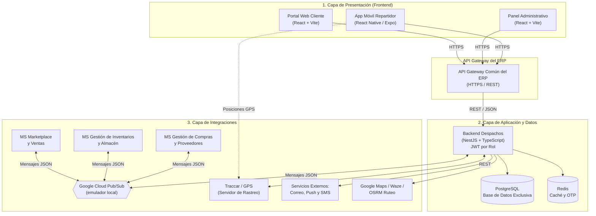
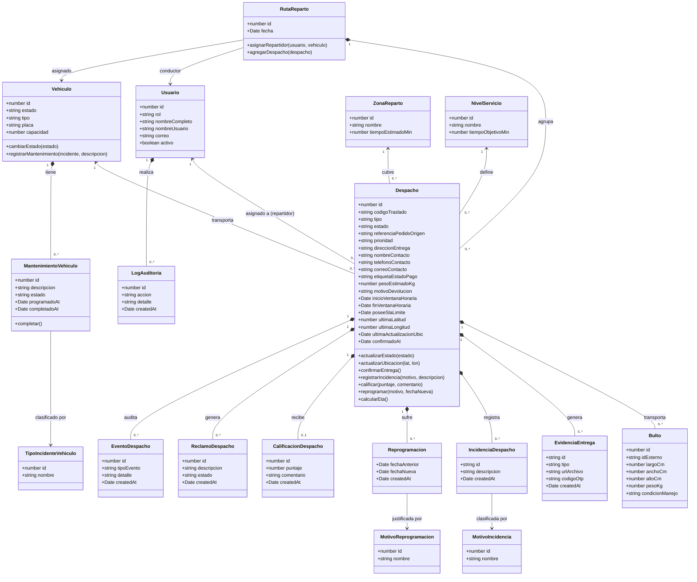

# Sistema de Gestión de Entregas y Despachos (Despachos)
**Microservicio del ERP Corporativo – Supermercado / Retailer (Grupo H)**  
*Caso de estudio: HIPERMAXI, DISMAC*

---

## 👥 Equipo del Proyecto

| Nombre Completo | Rol |
|---|---|
| **Pardo Romano Alejandro Miguel** | Líder de equipo / Product Owner |
| **Riveros Soria Joan Marcelo** | Scrum Master |
| **Huaycho Clavel Jaime Ignacio** | Dev Backend |
| **Mendoza Choque Sergio Alexander** | Dev Frontend |

*Universidad Católica Boliviana "San Pablo" — La Paz, Bolivia*  
*Jira:* [Tablero de Proyecto Jira](https://joanmarceloriverossoria.atlassian.net/jira/software/projects/ES/boards/100/timeline)

---

## 1. Resumen Ejecutivo del Sistema

### 1.a. Presentación del Sistema de Información
**Despachos** es el microservicio de Gestión de Entregas y Despachos, uno de los nueve componentes que integran el ERP corporativo de una cadena de supermercados (junto con *Compras y Proveedores*, *Inventarios y Almacén*, *Recursos Humanos*, *Pagos y Facturación*, *Contabilidad*, *CRM*, *Marketplace y Ventas*, y *Producción y Logística*).

Su responsabilidad es **exclusivamente la última milla**: desde que un pedido queda listo para repartir hasta que se confirma su entrega al cliente final. Asigna repartidores y vehículos a cada pedido confirmado, da seguimiento a la entrega hasta su confirmación y gestiona las excepciones propias del reparto (cliente ausente, dirección incorrecta, producto dañado), dejando un registro auditable de cada evento.

> [!NOTE]
> Opera como un microservicio independiente, con base de datos PostgreSQL propia y API REST propia (NestJS) para sus clientes web y móvil, sin acceder directamente a las bases de datos de otros componentes del ERP. Se integra con tres microservicios mediante **mensajería asíncrona JSON (Google Cloud Pub/Sub, simulada con su emulador local durante el proyecto)**: **Marketplace y Ventas** (datos de entrega del pedido de venta), **Gestión de Inventarios y Almacén** (bultos preparados y confirmaciones de recepción) y **Gestión de Compras y Proveedores** (solicitudes de recogida en proveedor). No procesa cobros ni interactúa directamente con Pagos y Facturación. El detalle de tópicos y contratos está en [`interoperabilidad-y-flujos.md`](./interoperabilidad-y-flujos.md).

### 1.b. Propuesta de Valor

#### Para el cliente final:
* **Visibilidad total del pedido:** Estado, ubicación del repartidor y tiempo estimado de llegada (ETA) en tiempo real.
* **Comunicación proactiva:** Notificaciones automáticas por correo electrónico ante cada cambio de estado.
* **Evidencia y confianza:** Cada entrega queda respaldada con fotografía, firma electrónica o código OTP.
* **Canal directo de retroalimentación:** Calificación del servicio y reporte de reclamos.

#### Para el negocio (HIPERMAXI / DISMAC):
* **Control centralizado y trazable:** Toda la operación de última milla sin depender de coordinación manual.
* **Indicadores de cumplimiento:** SLA y tiempos de entrega para toma de decisiones operativas.
* **Escalabilidad:** Soporte de picos de operación (fin de mes, campañas comerciales) sin degradar el servicio.
* **Integración limpia:** Comunicación asíncrona por mensajes JSON con los demás módulos del ERP, conservando sus identificadores originales sin duplicar ni comprometer sus datos.

### 1.c. Funcionalidades Principales
1. Autenticación y control de acceso por roles (`Coordinador`, `Supervisor`, `Repartidor`, `Cliente`).
2. Registro automático de órdenes de despacho a partir de pedidos confirmados.
3. Asignación de repartidor y vehículo con agrupación de pedidos por zona.
4. Seguimiento en tiempo real mediante geolocalización y cálculo de ETA.
5. Registro de evidencia digital de entrega (foto, firma, OTP).
6. Gestión de incidencias y reprogramación de entregas fallidas.
7. Notificaciones push (repartidor) y por correo electrónico (cliente).
8. Calificación del servicio y gestión de reclamos.
9. Administración de flota: disponibilidad y mantenimiento de vehículos.
10. Reportes e indicadores de desempeño (cumplimiento, SLA, incidencias).
11. Auditoría y trazabilidad completa de todas las acciones y eventos del sistema.

### 1.d. Usuarios Principales
| Perfil | Plataforma | Descripción |
|---|---|---|
| **Repartidor / Transportista** | App Móvil (React Native) | Ejecuta la entrega física, actualiza estados y transmite su ubicación GPS en ruta desde la app móvil. |
| **Cliente Final** | Portal Web (Público) | Da seguimiento a su pedido mediante enlace con token único, recibe notificaciones y califica el servicio. |
| **Coordinador de Despachos / Logística** | Portal Web (Panel Admin) | Asigna pedidos a repartidores y vehículos, supervisa el cumplimiento y administra la configuración del microservicio (usuarios, catálogos, seguridad). |
| **Supervisor de Flota** | Portal Web (Panel Admin) | Monitorea vehículos y repartidores en tiempo real, gestiona disponibilidad/mantenimiento de vehículos e indicadores de flota. |

---

## 2. Arquitectura y Tecnología del Producto

### 2.a. Modelo de Despliegue por Capas

### 2.b. Integración con Sistemas Externos

| Sistema Externo | Dirección | Contenido del Intercambio |
|---|---|---|
| **Marketplace y Ventas** | Bidireccional (asíncrona) | Marketplace envía los datos de entrega del pedido de venta confirmado (destinatario, teléfono, dirección con coordenadas, referencias y preferencias), y sus cambios o cancelaciones; todos los pedidos se asumen pagados. Despachos informa el estado y resultado de cada entrega. |
| **Gestión de Inventarios y Almacén** | Bidireccional (asíncrona) | Almacén avisa cuando un pedido de venta está empacado y listo para retirar (bultos con ID, medidas y peso real), solicita recojos RMA y confirma la recepción física de recogidas y devoluciones. Despachos informa la salida física (transferencia de custodia) de los bultos. |
| **Gestión de Compras y Proveedores** | Bidireccional (asíncrona) | Compras envía solicitudes de recogida en proveedor ligadas a una orden de compra aprobada, con sus cambios o cancelación. Despachos informa la programación, el estado del traslado y sus incidencias. |
| **Traccar (Servidor GPS)** | Entrada | La app móvil envía posiciones periódicas al servidor Traccar; el componente de seguimiento de ubicación de Despachos consulta posiciones por REST para el tablero y el cálculo de ETA. |
| **Servicio de Correo / Push / SMS** | Salida | Notificaciones automáticas al cliente (correo), al repartidor (push) y envío del código OTP de entrega (SMS, mediante adaptador simulado durante el proyecto). |
| **Google Maps / Waze / OSRM** | Salida / Interno | Apertura de navegación externa hacia la dirección de entrega mediante enlaces profundos desde la app móvil y cálculo de rutas óptimas con OSRM. |

---

## 3. Modelo Estructural de Datos Estático

La entidad central es **`Despacho`**, que representa cada servicio de traslado: entrega al cliente, recogida en proveedor y recojo de devolución (logística inversa), distinguidos por su `tipo` (`delivery`, `supplier_pickup`, `warehouse_return_pickup` y `supplier_return`, catálogo `dispatch_types`). Concentra los datos de contacto, dirección, ventana horaria, prioridad, peso y marcas de tiempo del proceso. Despachos genera su propio `codigoTraslado` y conserva los identificadores originales del ERP (`referenciaPedidoOrigen`, que guarda el ID del pedido de venta o de la orden de compra según el tipo, y el ID de cada `Bulto`) para que cada sistema relacione sus registros sin confundirlos.

---

## 4. Pila Tecnológica del Microservicio

| Capa / Aspecto | Herramienta / Tecnología | Propósito |
|---|---|---|
| **Backend** | **NestJS (Node.js + TypeScript)** | API REST, lógica de negocio modular, WebSockets, validaciones Joi/class-validator. |
| **Frontend Web** | **React 19 + Vite 8 + TypeScript** | Portal público del cliente y Panel administrativo de despacho. Tailwind v4 + shadcn/ui. |
| **Frontend Móvil** | **React Native (Expo SDK 52)** | Aplicación nativa/híbrida para repartidores con NativeWind v4 y Expo Router. |
| **Base de Datos** | **PostgreSQL (v18+)** | Base de datos relacional independiente por microservicio con esquemas por dominio. |
| **Caché** | **Redis** | Caché de lectura con TTL corto (KPIs, reportes SLA, parámetros operativos) y control de vigencia e intentos del código OTP. |
| **Mensajería ERP** | **Google Cloud Pub/Sub (emulador local)** | Intercambio asíncrono de mensajes JSON con Marketplace, Inventarios y Compras; con adaptador en memoria para pruebas. |
| **Autenticación & Autorización** | **JWT con Refresh Tokens** | Control de acceso por roles (`Coordinador`, `Supervisor`, `Repartidor`, `Cliente`). |
| **Ruteo & ETA** | **OSRM (Open Source Routing Machine)** | Motor de ruteo self-hosted con extracto de mapas de Bolivia (Geofabrik). |
| **Rastreo GPS** | **Traccar + Geolocalización Móvil** | Transmisión de coordenadas en segundo plano desde la app móvil del repartidor. |
| **Notificaciones** | **Push (Expo/Firebase) + Mailer (Resend/SMTP) + SMS (adaptador simulado)** | Avisos a repartidores, notificaciones de estado por correo a clientes y envío del OTP de entrega. |
| **Generación de Reportes** | **Puppeteer / CSV** | Exportación de logs de auditoría, reportes de flota y cumplimiento SLA. |
