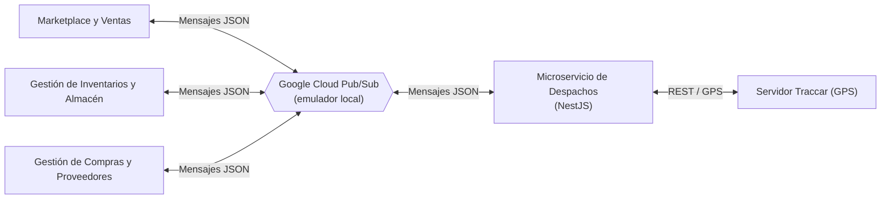
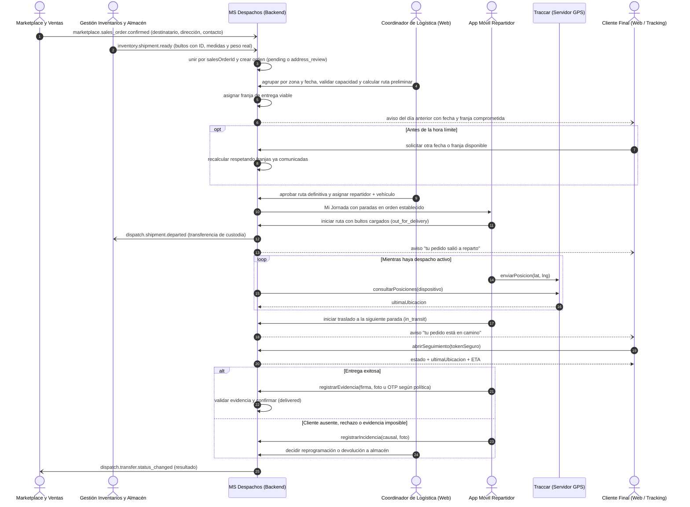
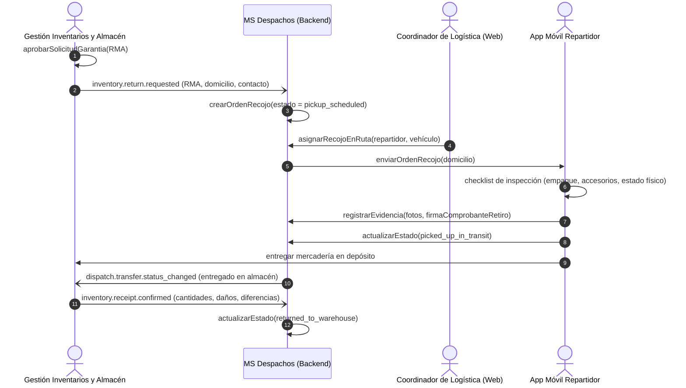
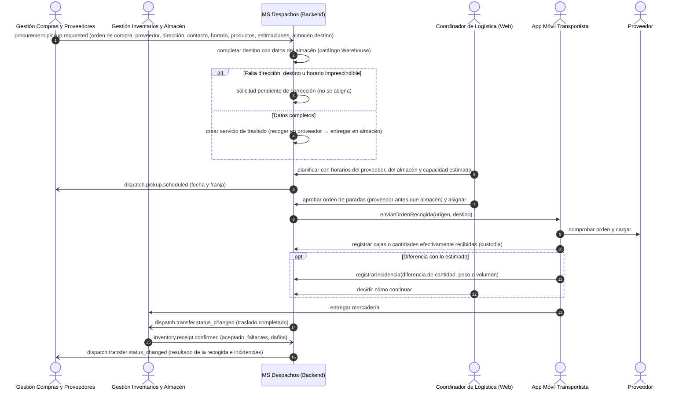
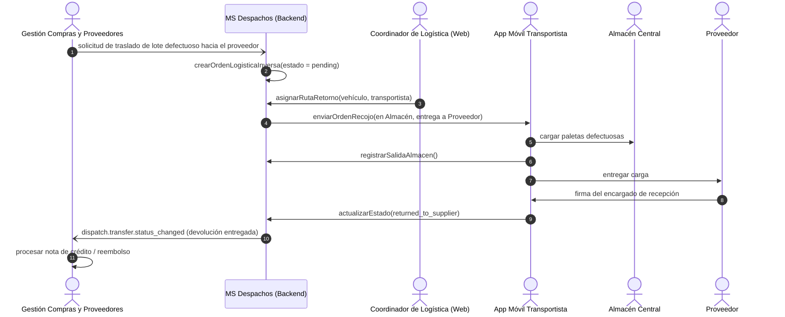

# Interoperabilidad y Flujos de Información (Escenarios de Negocio)
**Microservicio de Gestión de Entregas y Despachos (Grupo H)**

Este documento detalla los contratos de comunicación con el ERP y los diagramas de secuencia de los procesos clave del microservicio.

---

## 1. Matriz de Integración con el ERP Corporativo

El microservicio de Despachos se comunica con el ERP de forma **asíncrona mediante mensajes JSON** sobre **Google Cloud Pub/Sub**. Durante el proyecto no existen conexiones reales con los demás módulos: los mensajes de Marketplace, Inventarios y Compras se **simulan** con publicadores propios sobre el emulador local de Pub/Sub, usando exactamente los mismos contratos que tendría la integración real.



| Microservicio | Dirección | Información intercambiada |
|---|---|---|
| **Marketplace y Ventas** | Bidireccional | • Marketplace envía los datos de entrega de cada pedido de venta confirmado: destinatario, teléfono, dirección con coordenadas y referencias, preferencias y fecha límite. Todos los pedidos se asumen pagados, por lo que no se envía condición de pago.<br>• Marketplace avisa cambios de dirección o contacto y cancelaciones.<br>• Despachos informa el estado y resultado de cada entrega. |
| **Gestión de Inventarios y Almacén** | Bidireccional | • Almacén avisa cuando un pedido de venta está empacado y listo para retirar, con la lista de bultos (ID, medidas y peso bruto real) y, si corresponde, la política de evidencia requerida.<br>• Almacén avisa cambios de empaque, pedidos que dejan de estar listos o se cancelan.<br>• Almacén solicita recojos de devoluciones aprobadas (RMA) y confirma la recepción física de recogidas y devoluciones.<br>• Despachos informa la salida física de los bultos (transferencia de custodia). |
| **Gestión de Compras y Proveedores** | Bidireccional | • Compras envía solicitudes de recogida en proveedor ligadas a una orden de compra aprobada, con sus cambios o cancelación.<br>• Despachos informa la programación de la recogida, el estado del traslado y sus incidencias. |

> [!IMPORTANT]
> **Despachos no procesa ni registra cobros.** La gestión financiera y cobros es responsabilidad exclusiva del microservicio de *Gestión de Pagos y Facturación*, con el cual Despachos no tiene interfaz directa.

### 1.1. Responsabilidad sobre los datos

Cada servicio conserva la responsabilidad sobre sus propios registros. Despachos guarda solo lo necesario para planificar y ejecutar el traslado.

| Registro | Dueño | Qué hace Despachos |
|---|---|---|
| Orden de compra | Compras y Proveedores | La usa para organizar la recogida. No la crea ni la modifica. |
| Pedido de venta y datos del cliente | Marketplace y Ventas | Guarda solo los datos de entrega (nombre, teléfono, dirección con coordenadas, referencias, preferencias) No recibe datos de facturación ni de pago: todos los pedidos se asumen pagados y Despachos no gestiona cobros. |
| Bultos y recepción de inventario | Inventarios y Almacén | Planifica con las medidas reales de cada bulto. La recepción la confirma Almacén. |
| Servicio de traslado | Despachos | Genera un **ID de servicio de traslado** propio y conserva los IDs originales de la orden de compra, del pedido de venta y de cada bulto. |

### 1.2. Reglas comunes de los contratos

* **Sobre común:** todo mensaje viaja con un sobre estándar (ver 1.3) con `messageId` (UUID v7), `type`, `schemaVersion`, `source` y `occurredAt`.
* **IDs estables y versión del registro:** cada mensaje incluye el ID original del registro, su `updatedAt` y un `recordVersion` creciente. Despachos ignora un mensaje cuyo `recordVersion` sea menor o igual al ya procesado.
* **Idempotencia:** reenviar el mismo `messageId` no genera duplicados.
* **Validación de esquema:** cada tipo de mensaje tiene un JSON Schema. Un mensaje inválido no crea ni modifica registros; se envía al tópico de mensajes rechazados (dead-letter) con el detalle del error.
* **Unidades acordadas:** peso en kilogramos, medidas en centímetros, fechas en ISO-8601 UTC y coordenadas en WGS84.
* **Mensajes perdidos:** si un pedido lleva más de `incomplete_order_alert_minutes` (60 por defecto) con solo uno de los dos mensajes, Despachos publica `dispatch.sync.requested`; el origen responde con el registro completo por su tópico habitual. Tras 3 solicitudes sin respuesta se alerta al coordinador.
* **Llegadas en desorden:** los datos del pedido de venta (Marketplace) y los bultos (Almacén) se unen por `salesOrderId`. La orden de despacho se crea solo cuando ambos están disponibles; mientras tanto, el dato parcial queda en espera.
* **Publicación saliente no bloqueante:** los mensajes de Despachos se registran primero en una tabla de salida (patrón *outbox*) y se publican después, de modo que una falla del broker nunca bloquea la operación en calle.
* **Versionado:** se versiona el contenido del mensaje (`schemaVersion`), no los nombres de tópicos ni las rutas.

### 1.3. Sobre estándar de mensaje

| Campo | Tipo | Descripción |
|---|---|---|
| `messageId` | `string` (UUID v7) | Identificador único del mensaje; clave de idempotencia. |
| `type` | `string` | Nombre del tópico o tipo de evento (ej. `inventory.shipment.ready`). |
| `schemaVersion` | `number` | Versión del esquema de `data`. |
| `source` | `string` | Servicio emisor: `marketplace`, `inventory`, `procurement` o `dispatch`. |
| `occurredAt` | `string` (ISO-8601 UTC) | Momento en que ocurrió el hecho. |
| `data` | `object` | Contenido propio del tipo de mensaje; incluye el ID original, `updatedAt` y `recordVersion`. |

Ejemplo:

```json
{
  "messageId": "0192f1e2-7c3a-7b41-9a1e-5d2f0c8e4a10",
  "type": "inventory.shipment.ready",
  "schemaVersion": 1,
  "source": "inventory",
  "occurredAt": "2026-10-07T14:03:00Z",
  "data": {
    "salesOrderId": "SO-2026-000123",
    "recordVersion": 3,
    "updatedAt": "2026-10-07T14:02:51Z",
    "warehouseId": "WH-LPZ-01",
    "availableFrom": "2026-10-07T15:00:00Z",
    "packages": [
      { "packageId": "PKG-000123-1", "lengthCm": 40, "widthCm": 30, "heightCm": 25, "grossWeightKg": 6.4 }
    ],
    "handlingConditions": ["FRAGILE"]
  }
}
```

### 1.4. Catálogo de tópicos (propuesta inicial)

> [!NOTE]
> Catálogo propuesto para validar con el equipo y el docente. Los JSON Schema de cada tópico se publican junto al código del backend (HU `ES-76`).

**Mensajes que recibe Despachos:**

| Tópico | Emisor | Contenido | Flujo |
|---|---|---|---|
| `marketplace.sales_order.confirmed` | Marketplace | Pedido de venta confirmado con datos de entrega del cliente (dirección con coordenadas). | Entrega al cliente |
| `marketplace.sales_order.updated` | Marketplace | Cambio de dirección, contacto o preferencias. | Entrega al cliente |
| `marketplace.sales_order.cancelled` | Marketplace | Cancelación del pedido de venta. | Entrega al cliente |
| `inventory.shipment.ready` | Inventarios | Pedido empacado y listo para retirar, con bultos y política de evidencia opcional. | Entrega al cliente |
| `inventory.shipment.updated` | Inventarios | Cambio de empaque o pedido que deja de estar listo. | Entrega al cliente |
| `inventory.shipment.cancelled` | Inventarios | Retiro cancelado por Almacén. | Entrega al cliente |
| `inventory.return.requested` | Inventarios | Devolución aprobada (RMA) que requiere recojo en domicilio. | Devolución de cliente |
| `inventory.receipt.confirmed` | Inventarios | Recepción física confirmada: cantidades aceptadas, faltantes, daños o diferencias. | Recogida y devoluciones |
| `procurement.pickup.requested` | Compras | Solicitud de recogida ligada a una orden de compra aprobada. | Recogida en proveedor |
| `procurement.pickup.updated` | Compras | Cambio en la orden mientras la recogida sigue pendiente. | Recogida en proveedor |
| `procurement.pickup.cancelled` | Compras | Cancelación de la recogida. | Recogida en proveedor |

**Mensajes que publica Despachos:**

| Tópico | Destinatario | Contenido | Flujo |
|---|---|---|---|
| `dispatch.shipment.departed` | Inventarios | Salida física de los bultos y transferencia de custodia al repartidor. | Entrega al cliente |
| `dispatch.pickup.scheduled` | Compras | Fecha y franja programada para la recogida en proveedor. | Recogida en proveedor |
| `dispatch.sync.requested` | Marketplace / Inventarios | Solicitud del registro completo de un pedido cuyo mensaje no llegó. | Entrega al cliente |
| `dispatch.transfer.status_changed` | Marketplace / Compras / Inventarios | Estado del servicio de traslado, incluido su resultado final. | Todos |
| `dispatch.transfer.incident_reported` | Marketplace / Compras | Incidencia registrada en el traslado y siguiente paso decidido por Despacho. | Todos |

### 1.5. Simulación durante el proyecto

* El emulador de Pub/Sub se levanta en `docker-compose` junto al backend.
* Scripts publicadores con *fixtures* JSON simulan a Marketplace, Inventarios y Compras, incluyendo mensajes en desorden, reenvíos y mensajes inválidos.
* Un consumidor simulado registra los mensajes que publica Despachos, para verificar los contratos salientes.
* Las pruebas unitarias usan un adaptador de mensajería en memoria, sin depender de Docker.

### 1.6. Acuerdos pendientes

1. **Validación docente:** confirmar que Marketplace y Ventas puede enviar directamente a Despachos los datos de entrega del pedido de venta.
2. **Recuperación de avisos perdidos:** definir cómo Despachos solicita el registro completo si se pierde un mensaje.
3. **Datos mínimos y formatos finales:** acordar campos obligatorios, unidades y formatos de cada tópico con los demás equipos.

---

## 2. Escenarios de Negocio y Diagramas de Secuencia

> [!NOTE]
> Las flechas asíncronas (`-)`) hacia o desde los microservicios del ERP representan mensajes que viajan por Pub/Sub. Se omite el broker en los diagramas para simplificar la lectura.

---

### 📦 Escenario 1: Entrega de Pedido a Cliente (Logística Directa)

Un repartidor lleva varios pedidos en una misma ruta. Al salir del almacén, todos los pedidos cargados pasan a `out_for_delivery`. `in_transit` indica que el repartidor se dirige al domicilio de un pedido concreto, por lo que solo un pedido está `in_transit` a la vez.

La franja comunicada al cliente el día anterior es un **compromiso**: el cliente puede pedir otra fecha o franja disponible hasta la hora límite de cierre de rutas, y cualquier recálculo posterior debe respetar las franjas ya comunicadas a los demás clientes. Si una franja deja de ser viable, Despacho resuelve el caso y avisa al cliente; la franja nunca cambia en silencio.



---

### 🔄 Escenario 2: Devolución de Cliente en Domicilio (Logística Inversa)



---

### 🚚 Escenario 3: Recogida de Mercadería en Proveedor (Abastecimiento)

La recogida nace de una **orden de compra** y es un flujo distinto de la entrega al cliente. Los productos recibidos ingresan al inventario y después pueden usarse para uno o varios pedidos de clientes.



---

### ⚠️ Escenario 4: Devolución de Mercadería Defectuosa a Proveedor

> [!NOTE]
> Escenario previsto para una fase posterior. Sus tópicos se definirán cuando se planifique la HU correspondiente.



---

## 3. Catálogo de Eventos en Tiempo Real (Socket.io)

Canal interno hacia el panel web y la app móvil. **No se usa para comunicarse con el ERP.** Un único gateway (`DispatchEventsGateway`) emite los eventos después de cada confirmación en base de datos; el cliente autentica con su JWT y se une a salas por rol, zona o repartidor.

| Evento | Se emite cuando | Salas destinatarias | Payload mínimo |
|---|---|---|---|
| `dispatch.status_changed` | Cambia el estado de un despacho. | Coordinadores, supervisores, zona del despacho y repartidor asignado. | `{ dispatchId, status, previousStatus, version, updatedAt }` |
| `dispatch.incident_reported` | El repartidor registra una incidencia (criticidad alta). | Coordinadores y supervisores de la zona. | `{ dispatchId, incidentId, reasonCode, reportedAt }` |
| `dispatch.evidence_registered` | Se registra evidencia de entrega (firma, foto u OTP). | Coordinadores y supervisores. | `{ dispatchId, evidenceId, type, registeredAt }` |
| `dispatch.change_requires_attention` | Llega un cambio o cancelación del ERP sobre un despacho ya asignado. | Coordinadores. | `{ dispatchId, source, changeType (`order_changed`, `order_cancelled` o `incomplete_order`), receivedAt }` |
| `route.assigned` | Se asigna una ruta a un repartidor y vehículo. | Coordinadores y repartidor asignado. | `{ routeId, driverId, vehicleId, dispatchIds, version }` |

---

## 4. Glosario de Estados del Despacho

Los identificadores de estado están en inglés y en minúscula, igual que la tabla `dispatch_statuses`. Los textos que ve el usuario siguen en español. `in_transit` ya existía antes del Sprint 2 y significa «en camino a una parada concreta»; el resto se agrega con las migraciones de `ST-49.2`.

| Estado | Se muestra como | Significado |
|---|---|---|
| `pending` | Pendiente | Pedido listo, sin ruta asignada. |
| `address_review` | Dirección en revisión | Sin coordenadas válidas o fuera de cobertura; el coordinador debe fijar el punto en el mapa. |
| `in_planning` | En planificación | Reservado por un coordinador que arma una ruta (reserva temporal). |
| `scheduled` | Programado | Con fecha, franja y ruta preliminar definidas. |
| `assigned` | Asignado | Ruta aprobada y asignada a un repartidor y un vehículo. |
| `out_for_delivery` | En ruta | El repartidor salió del almacén con los bultos; todos los pedidos de la ruta pasan a este estado. |
| `in_transit` | En camino | El repartidor se dirige al domicilio de este pedido; normalmente solo uno a la vez. |
| `delivered` | Entregado | Entrega confirmada con la evidencia exigida. |
| `not_delivered` | No entregado | La visita no se concretó. |
| `incident` | Incidencia | El repartidor reportó un problema; Despacho decide la reprogramación o la devolución. |
| `rescheduled` | Reprogramado | Nueva fecha pactada; vuelve a la bandeja ese día. |
| `returned` | Devuelto | El pedido regresa al almacén. |
| `pickup_scheduled` | Recojo programado | Recojo de devolución en domicilio, listo para asignar. |
| `picked_up_in_transit` | Recogido en tránsito | Mercadería retirada del cliente, en camino al almacén. |
| `returned_to_warehouse` | Devuelto a almacén | Almacén confirmó la recepción de la devolución. |

> La posición de una parada dentro de la ruta es `sequence_order` en base de datos, backend y app; en pantalla se muestra como «Parada #n».
