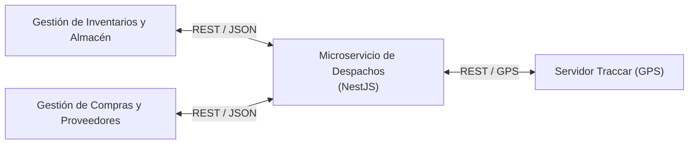
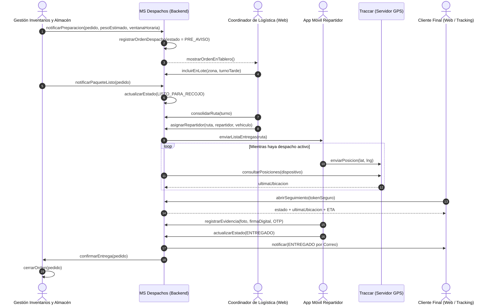
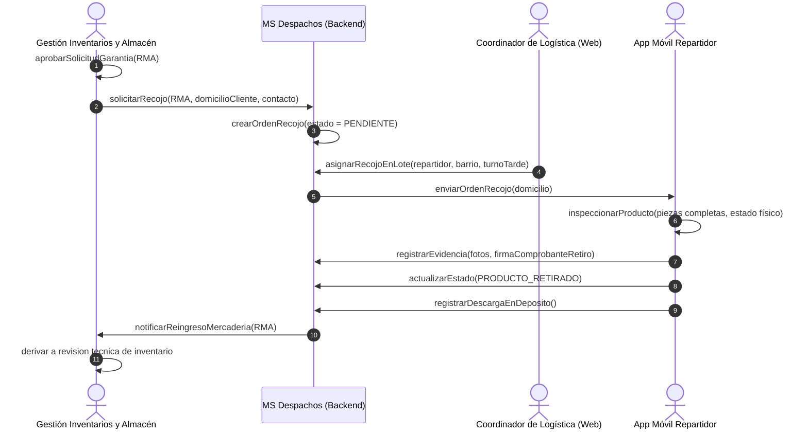
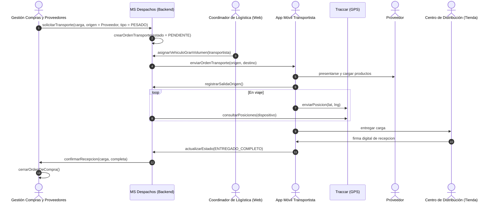
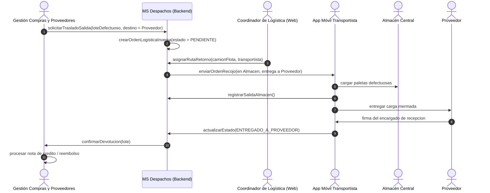

# Interoperabilidad y Flujos de Información (Escenarios de Negocio)
**Microservicio de Gestión de Entregas y Despachos (Grupo H)**

Este documento detalla los contratos de comunicación y los diagramas de secuencia de los cuatro procesos clave del microservicio.

---

## 1. Matriz de Integración con el ERP Corporativo

El microservicio de Despachos se comunica de forma **síncrona (REST/JSON)** a través del API Gateway común con únicamente dos microservicios externos:

| Microservicio | Dirección | Eventos / Flujo de Información |
|---|---|---|
| **Gestión de Inventarios y Almacén** | Bidireccional | • Almacén notifica pedido preparado (`picking`/`packing`) o solicitud de devolución aprobada (RMA) con datos del cliente. • Despachos confirma salida física de almacén o recolección en domicilio. • Despachos reporta reingreso de mercadería por devoluciones/cancelaciones. |
| **Gestión de Compras y Proveedores** | Bidireccional | • Compras notifica órdenes de despacho y recojo de mercadería desde proveedores hacia tiendas/almacén central. • Despachos reporta logística inversa (productos dañados devueltos al proveedor) y confirmación de recepción en destino. |

> [!IMPORTANT]
> **Despachos no procesa ni registra cobros.** La gestión financiera y cobros es responsabilidad exclusiva del microservicio de *Gestión de Pagos y Facturación*, con el cual Despachos no tiene interfaz directa.

---

## 2. Escenarios de Negocio y Diagramas de Secuencia

---

### 📦 Escenario 1: Entrega de Pedido a Cliente (Logística Directa)

---

### 🔄 Escenario 2: Devolución de Cliente en Domicilio (Logística Inversa)

---

### 🚚 Escenario 3: Traslado de Mercadería desde Proveedor (Abastecimiento)

---

### ⚠️ Escenario 4: Devolución de Mercadería Defectuosa a Proveedor

