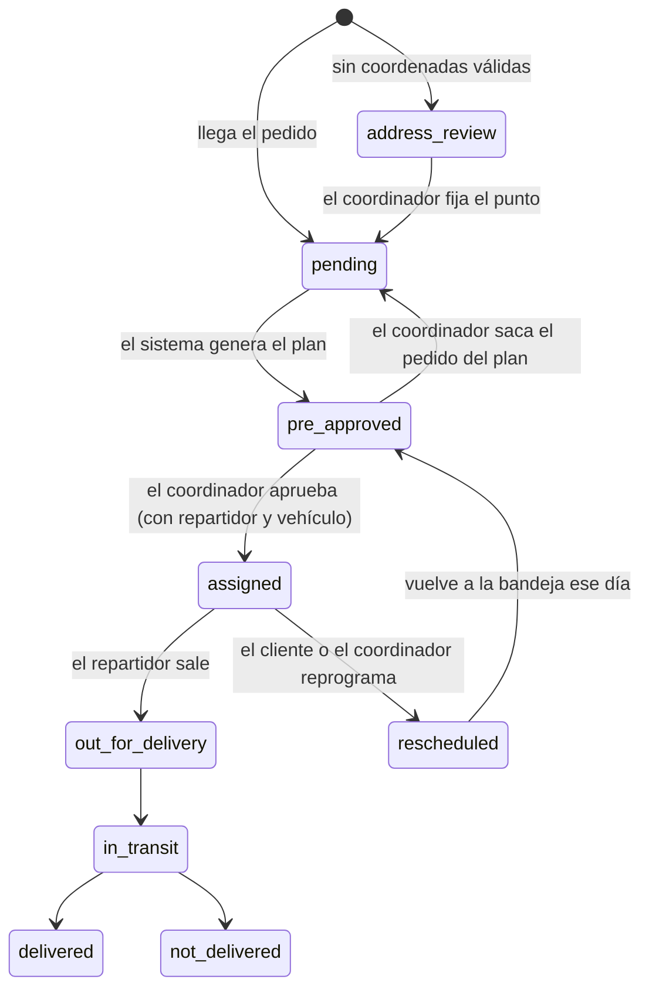

# Propuesta: planificación semiautomática de entregas (borrador)

**Estado:** BORRADOR para revisión del equipo y del ingeniero. No es fuente de verdad todavía: nada de lo que dice aquí se implementa hasta que se confirmen las preguntas de la sección 9 y se actualicen `docs/` y Jira.
**Origen:** análisis de ES-48, ES-49, ES-50, ES-51, ES-52 y ES-57 del Sprint 2, y recomendación del ingeniero de simplificar porque el ERP se simula.
**Fecha:** 2026-10-08

---

## 1. Qué problema resuelve

El sprint actual supone que el coordinador **arma las rutas a mano**: elige pedidos en la bandeja, previsualiza la ruta y luego elige repartidor y vehículo. Eso deja varios huecos:

- Dos coordinadores pueden crear dos rutas separadas para direcciones vecinas (ej. Achumani 21 y Achumani 22) que un solo repartidor podría hacer.
- Se hacen viajes por un solo pedido porque nadie ve el panorama de toda la semana.
- No hay datos de quién conduce qué ni de turnos, así que la «recomendación de 3 recursos» de ES-51 no se puede calcular.
- Un lote que no cabe en un vehículo se descubre tarde, en el último paso.

**Propuesta:** el sistema **propone** el plan (zonas, fechas, franjas y vehículo recomendado) y el coordinador lo **revisa, corrige y aprueba**.

## 2. Alcance de la simulación

Como no nos conectamos con los otros módulos del ERP, se simplifica sin perder la capacidad de **mostrar el negocio**.

| Se mantiene | Se simplifica o se deja fuera |
|---|---|
| Clasificación de pedidos por zona y fecha | Perfil de qué vehículos maneja cada repartidor: **todos pueden manejar cualquiera** |
| Fecha y franja tentativas, con consolidación de días flojos | Turnos con vehículo preasignado por repartidor |
| Estado `pre_approved` y aprobación del coordinador | Catálogo de tipos de vehículo (la recomendación sale de `capacity_kg` y `capacity_m3`) |
| Vehículo recomendado por capacidad | Optimización multivehículo con OSRM (queda para una segunda versión) |
| Edición manual por el coordinador | Integración real de correo o SMS (se simula) |
| Página pública de seguimiento y reprogramación | |
| Reserva suave de pedidos (ST-48.2) al editar un plan | |

## 3. Flujo propuesto

**Ejemplo ilustrativo** (los números son inventados para explicar):

El **lunes** hay 60 pedidos `pending`.

1. **Clasificar.** El sistema toma los pedidos, empezando por los más antiguos, y los agrupa por zona:

   | Zona | Pedidos | Peso total |
   |---|---|---|
   | Sur | 28 | 410 kg |
   | Norte | 17 | 220 kg |
   | Centro | 12 | 95 kg |
   | Este | 3 | 18 kg |

2. **Asignar fechas tentativas.** Según la capacidad diaria, reparte: Sur martes y jueves; Norte miércoles; Centro martes; Este... solo 3 pedidos.
3. **Consolidar.** El jueves solo queda 1 pedido de la zona Este. En vez de hacer un viaje por uno, el sistema lo **mueve al viernes**, donde ya hay 2 más de esa zona. Antes de postergar, prueba si se puede fusionar con una zona vecina ese mismo día.
4. **Recomendar vehículo.** Para cada ruta propuesta elige el vehículo activo que mejor calza con el peso y el volumen. Si no cabe en uno, propone una división.
5. **Pasar a `pre_approved`.** Los pedidos quedan agrupados por fecha, zona y vehículo recomendado.
6. **El coordinador revisa.** Aprueba tal cual, o corrige a mano (mover un pedido de día, cambiar el vehículo, sacar un pedido). Mientras edita, los pedidos quedan **reservados** a su nombre.
7. **Se aprueba.** Se confirman fecha y franja. Recién entonces se **avisa al cliente** por correo (ver pregunta P1).
8. **El cliente puede reprogramar** desde la página pública.
9. **El repartidor** recibe su ruta en la app móvil y sigue el flujo normal (`out_for_delivery`, `in_transit`, entrega).

## 4. Estados

Estados que ya existen en `dispatch_statuses` (migración 009): `pending`, `address_review`, `in_planning`, `scheduled`, `assigned`, `out_for_delivery`, `in_transit`, `delivered`, `not_delivered`, `incident`, `rescheduled`, `returned`, etc.

Estado nuevo propuesto: **`pre_approved`** (propuesta del sistema pendiente de aprobar).

`in_planning` **no es un estado guardado**: es lo que la bandeja muestra mientras un coordinador tiene una reserva viva sobre el pedido.

## 5. Reglas del plan (propuestas)

1. **Orden de proceso:** pedidos más antiguos primero.
2. **Nunca se posterga** un pedido `urgent`, uno de servicio express, ni uno que pasaría de su fecha límite o de su SLA.
3. **Se posterga** un pedido solo si el viaje no se justifica (menos del mínimo de pedidos u ocupación) y sin superar el máximo de días de espera.
4. **Antes de postergar**, se intenta fusionar con una zona vecina el mismo día.
5. **Capacidad por día:** no se programan más rutas que vehículos activos ese día; los repartidores son intercambiables.
6. **Los pedidos en `address_review`** quedan fuera del plan hasta que el coordinador fije su ubicación.
7. **Una vez comunicada una franja al cliente**, el sistema no la cambia en silencio al recalcular (regla ya vigente en `interoperabilidad-y-flujos.md`).

## 6. Página pública de seguimiento y reprogramación

- El correo trae: fecha y franja, un enlace al seguimiento y un **número de seguimiento**.
- La página **no pide login**. Permite rastrear el pedido y solicitar otra fecha.
- **Seguridad (importante):** el código `DSP-AAAA-NNNNN` es **secuencial**, así que cualquiera podría probar números vecinos y ver datos ajenos o reprogramar pedidos de otros. Propuesta:
  - El enlace usa el `tracking_token` (aleatorio, con vencimiento), que ya existe en `dispatches`.
  - Si se permite escribir el número a mano, exigir un segundo dato (ej. últimos 4 dígitos del teléfono).
  - Limitar intentos por IP.
  - Mostrar solo lo necesario: sin dirección completa ni teléfono.
- **Reprogramación:** solo se ofrecen fechas en las que ya existe una ruta hacia su zona con capacidad, hasta la hora de corte, y con un máximo de intentos (`max_reschedule_attempts`).

## 7. Parámetros propuestos (en `settings`)

Todos ajustables por el coordinador sin redeploy. Los nombres y valores son sugerencias.

| Clave | Valor inicial | Para qué |
|---|---|---|
| `plan_horizon_days` | 4 | Cuántos días hacia adelante se planifica |
| `plan_working_days` | `1,2,3,4,5` | Días hábiles de reparto (1 = lunes) |
| `plan_min_orders_per_route` | 3 | Mínimo de pedidos para justificar un viaje |
| `plan_min_occupancy_pct` | 30 | Alternativa al mínimo anterior, por ocupación |
| `plan_max_postpone_days` | 3 | Máximo de días que se puede postergar un pedido |
| `plan_merge_neighbor_zones` | `true` | Intentar fusionar con zona vecina antes de postergar |
| `route_cutoff_time` | `18:00` | Hora límite para que el cliente reprograme (ya previsto en ES-57) |
| `max_reschedule_attempts` | 2 | Reprogramaciones permitidas por pedido (ya previsto en ES-57) |
| `order_reservation_ttl_minutes` | 15 | Reserva suave (ya implementado en ST-48.2) |

## 8. Impacto en el sprint

| Historia / subtarea | Cambio |
|---|---|
| **ST-48.2** (bandeja y reserva suave) | Sigue vigente. Hay que extender el predicado de qué entra (`inbox-eligibility.ts`) para incluir o excluir `pre_approved` según se decida |
| **ES-49** (órdenes de despacho) | Sin cambio; solo suma la ventana tentativa |
| **ES-50** (agrupar y rutas preliminares) | **Cambia:** de «el coordinador agrupa» a «el sistema genera el plan». ST-50.1 (capacidad) se reutiliza; ST-50.2 pasa a ser el generador |
| **ES-51** (asignar repartidor y vehículo) | **Cambia:** pasa a ser la aprobación del plan. La «recomendación de 3 recursos» se reduce a repartidores libres y vehículo recomendado por capacidad |
| **ES-52** (reprogramar) | Se amplía con la reprogramación del cliente desde la página pública |
| **ES-57** (parámetros) | Se amplía con las claves de la sección 7 |
| **BD** | Estado `pre_approved`; columna `version` en `dispatches` (para el control optimista de ES-51, hoy no existe); posible tabla de planes |
| **Nuevo** | Página pública de seguimiento y reprogramación (web), y generador de plan (back) |

## 9. Preguntas a confirmar

Cada pregunta trae un caso de ejemplo, las opciones y una recomendación. Responder marcando la opción o escribiendo otra.

### Bloque A — Reglas que definen cómo se arma el plan (bloquean el diseño)

**P1. ¿Cuándo se avisa al cliente de la fecha y la franja?**
- *Caso:* el lunes el sistema propone entregar el pedido de María el jueves de 09:00 a 12:00. El martes el coordinador, al revisar, lo cambia al viernes.
- *Problema:* si el correo salió el lunes, María ya se organizó para el jueves. El documento de flujos dice que la franja comunicada es un compromiso que no cambia en silencio.
- *Opciones:*
  - a) Avisar solo cuando el coordinador **aprueba**.
  - b) Avisar de inmediato, con la leyenda «fecha tentativa».
- *Recomendación:* **a**.
- *Respuesta del equipo:* ______

**P2. ¿Qué significa «aprobar»?**
- *Caso:* el coordinador revisa el plan del jueves (zona Sur, 8 pedidos, camioneta). Pulsa «Aprobar».
- *Problema:* ¿en ese momento ya queda asignado a un repartidor y un vehículo, o solo se confirma fecha y franja y el repartidor se asigna después?
- *Opciones:*
  - a) Aprobar = `assigned`. El sistema ya propuso repartidor y vehículo, y el coordinador los puede cambiar antes de aprobar.
  - b) Aprobar = `scheduled` (fecha y franja confirmadas) y la asignación del repartidor es un paso aparte.
- *Recomendación:* **a** (menos pasos para la demostración y se aprovecha que los repartidores son intercambiables).
- *Respuesta del equipo:* ______

**P3. ¿Qué pedidos nunca se postergan?**
- *Caso:* el jueves solo hay 1 pedido en la zona Este, y es `urgent`. Si se aplica la regla de «no hacer viaje por un solo pedido», se pasaría al viernes.
- *Opciones:*
  - a) Los `urgent` y los de servicio express **nunca** se postergan; se hace el viaje aunque sea uno solo.
  - b) Se postergan igual, pero con un aviso al coordinador.
- *Recomendación:* **a**. Además, nunca se pasa de la fecha límite del pedido ni de su SLA.
- *Respuesta del equipo:* ______

**P4. ¿Cuántos días como máximo se puede postergar un pedido?**
- *Caso:* un pedido de la zona Este llega el lunes y es el único de esa zona. El martes también está solo, y el miércoles igual.
- *Problema:* sin tope, podría esperar indefinidamente a que llegue otro.
- *Opciones:* a) 2 días, b) 3 días, c) otro valor.
- *Recomendación:* **3 días** como parámetro ajustable (`plan_max_postpone_days`); pasado el tope, se hace el viaje aunque sea único.
- *Respuesta del equipo:* ______

**P5. ¿Cuántos pedidos justifican un viaje?**
- *Caso:* el jueves en la zona Sur hay 2 pedidos que pesan 3 kg en total. Un viaje en camioneta para eso gasta más de lo que vale.
- *Opciones:*
  - a) Mínimo de pedidos por ruta (ej. 3).
  - b) Mínimo de ocupación del vehículo (ej. 30 %).
  - c) Ambos, y se cumple uno de los dos.
- *Recomendación:* **c**, ambos parámetros en `settings`.
- *Respuesta del equipo:* ______

**P6. ¿Se intenta fusionar zonas vecinas antes de postergar?**
- *Caso:* el martes hay 1 pedido en Achumani y 5 en Calacoto, zonas contiguas. Un solo repartidor puede hacer ambos en la misma ruta.
- *Opciones:*
  - a) Sí: antes de postergar, se intenta sumar el pedido a una ruta de zona vecina el mismo día.
  - b) No: se mantiene la separación estricta por zona.
- *Recomendación:* **a**, pero entonces hay que definir qué zonas son «vecinas» (una lista simple por zona bastaría para la demostración).
- *Respuesta del equipo:* ______

**P7. ¿Cuántas rutas se pueden hacer por día y qué días se reparte?**
- *Caso:* el lunes hay 60 pedidos y la empresa tiene 3 vehículos activos. Sin saber eso, el sistema podría programar todo el martes.
- *Preguntas:* ¿se reparte de lunes a viernes o también sábado? ¿Una ruta por vehículo por día, o dos (mañana y tarde)?
- *Recomendación:* lunes a viernes, una ruta por vehículo y por franja (mañana y tarde), con el número de rutas igual a vehículos activos ese día.
- *Respuesta del equipo:* ______

### Bloque B — Cómo y cuándo se genera el plan

**P8. ¿Quién dispara el plan y con qué frecuencia?**
- *Caso:* el lunes a las 18:00 hay 60 pedidos pendientes.
- *Opciones:*
  - a) El coordinador pulsa «Generar plan».
  - b) Se genera solo cada noche.
  - c) Ambas: automático de noche y botón para regenerar.
- *Problema:* si dos coordinadores pulsan el botón a la vez se duplican las propuestas.
- *Recomendación:* **a** para la demostración, con una protección para que no corran dos generaciones simultáneas.
- *Respuesta del equipo:* ______

**P9. ¿Qué pasa con los pedidos que llegan después de generar el plan?**
- *Caso:* el martes entra un pedido en zona Sur, donde ya hay una ruta el jueves con espacio.
- *Opciones:*
  - a) Queda en la bandeja como `pending` hasta la próxima generación.
  - b) Se suma automáticamente a la ruta del jueves si hay capacidad.
- *Recomendación:* **a** (más simple y predecible); el coordinador puede sumarlo a mano.
- *Respuesta del equipo:* ______

**P10. ¿Cuántos días hacia adelante se planifica?**
- *Caso:* el lunes con 60 pedidos: ¿se arma solo martes o hasta el viernes?
- *Recomendación:* 4 días hábiles (`plan_horizon_days`).
- *Respuesta del equipo:* ______

### Bloque C — El cliente y la página pública

**P11. ¿Qué fechas puede elegir el cliente al reprogramar?**
- *Caso:* Pedro, de la zona Norte, quiere cambiar su entrega al miércoles, pero ese día no hay ruta hacia el Norte.
- *Problema:* si se le deja elegir cualquier fecha, el sistema crea un viaje por un solo pedido y se pierde la consolidación.
- *Opciones:*
  - a) Solo se le ofrecen fechas donde ya hay una ruta a su zona con capacidad.
  - b) Cualquier fecha, y el sistema la acomoda después.
- *Recomendación:* **a**.
- *Respuesta del equipo:* ______

**P12. ¿Qué pasa si el cliente reprograma cuando el plan ya está aprobado?**
- *Caso:* la ruta del jueves tiene 6 paradas y ya fue aprobada. El cliente de la parada 3 la pasa al viernes.
- *Problema:* hay que recalcular el orden de paradas, y las franjas de los otros 5 clientes ya fueron comunicadas.
- *Opciones:*
  - a) Se quita la parada y las demás conservan su franja (puede quedar algún hueco).
  - b) Se recalcula todo, pero se avisa al coordinador y a los afectados.
- *Recomendación:* **a**: nunca se cambia en silencio la franja de otros clientes.
- *Respuesta del equipo:* ______

**P13. ¿Cuántas veces puede reprogramar y hasta cuándo?**
- *Caso:* un cliente ya reprogramó dos veces y pide un tercer cambio a las 20:00 del día anterior a la entrega.
- *Recomendación:* máximo 2 intentos (`max_reschedule_attempts`) y hasta las 18:00 del día anterior (`route_cutoff_time`); pasado el límite, el sistema le indica que contacte a Despacho.
- *Respuesta del equipo:* ______

**P14. ¿Cómo se identifica el cliente en la página pública?**
- *Caso:* alguien escribe `DSP-2026-00013`, el número de su vecino, que es el siguiente al suyo.
- *Problema:* con un número secuencial puede ver o reprogramar un pedido ajeno.
- *Opciones:*
  - a) El enlace del correo lleva un token aleatorio y no hace falta teclear nada.
  - b) Se teclea el número, pero se exige un segundo dato (últimos 4 dígitos del teléfono).
  - c) Ambas.
- *Recomendación:* **c**, con límite de intentos por IP.
- *Respuesta del equipo:* ______

**P15. ¿Qué pasa con un cliente sin correo?**
- *Caso:* el pedido llega sin `contact_email`.
- *Opciones:*
  - a) Se muestra el enlace en el panel del coordinador para que se lo comparta por otro medio.
  - b) Se bloquea el pedido hasta que tenga correo.
- *Recomendación:* **a**.
- *Respuesta del equipo:* ______

### Bloque D — Recursos, vehículos y aprobación

**P16. ¿Cómo se considera a los repartidores disponibles?**
- *Caso:* hay 5 repartidores activos, uno de vacaciones y otro ya con una ruta el jueves.
- *Problema:* no existe una tabla de turnos ni de días libres.
- *Opciones:*
  - a) Disponible = activo y sin otra ruta en esa fecha y franja.
  - b) Crear una tabla simple de ausencias.
- *Recomendación:* **a** para la demostración; **b** queda como mejora.
- *Respuesta del equipo:* ______

**P17. ¿Cómo elige el sistema el vehículo recomendado?**
- *Caso:* una ruta pesa 380 kg y ocupa 1,8 m³. Hay un camión (500 kg), una camioneta (300 kg) y una moto (60 kg), todos libres.
- *Opciones:*
  - a) El vehículo **más pequeño** en el que quepa (el camión, porque la camioneta no alcanza).
  - b) El que deje menos espacio libre.
  - c) El más barato de operar (requeriría un costo por vehículo).
- *Y si no cabe en ninguno:* proponer una división, por ejemplo camioneta + moto, repartiendo por cercanía geográfica.
- *Recomendación:* **a**, y la división con un algoritmo simple que muestre las alternativas con su ocupación.
- *Respuesta del equipo:* ______

**P18. ¿Qué pasa si no hay vehículos suficientes?**
- *Caso:* el plan necesita 4 rutas el martes pero solo hay 3 vehículos activos.
- *Opciones:*
  - a) El sistema mueve la ruta de menor prioridad al día siguiente.
  - b) Deja la ruta sin vehículo y alerta al coordinador.
- *Recomendación:* **a**, respetando la regla de P3 (nunca postergar urgentes), y **b** si no hay forma de acomodar todo.
- *Respuesta del equipo:* ______

**P19. ¿Se puede aprobar solo una parte del plan?**
- *Caso:* el plan tiene 5 rutas. El coordinador está de acuerdo con 4 y quiere revisar la quinta.
- *Opciones:*
  - a) Aprobar ruta por ruta.
  - b) Todo o nada.
- *Recomendación:* **a**.
- *Respuesta del equipo:* ______

**P20. ¿Qué pasa si dos coordinadores editan o aprueban el mismo plan?**
- *Caso:* Ana y Luis abren la ruta del jueves a la vez. Ana saca un pedido y Luis aprueba la ruta completa.
- *Recomendación:* la reserva suave ya implementada bloquea la edición simultánea de los mismos pedidos; la aprobación usa control de versión para que la segunda falle con un mensaje claro (409), como pide ES-51.
- *Respuesta del equipo:* ______

**P21. ¿Qué hace el coordinador con los pedidos en `address_review`?**
- *Caso:* un pedido llega con una dirección fuera de todas las zonas del catálogo.
- *Recomendación:* queda fuera del plan; el coordinador fija el punto en el mapa y el pedido pasa a `pending`, y entra en la siguiente generación.
- *Respuesta del equipo:* ______

## 10. Fuera de alcance de esta propuesta

- Optimización de rutas con varios vehículos usando OSRM.
- Perfiles de conducción y turnos con vehículo asignado.
- Integración real con correo o SMS.
- Notificaciones push de cambios de plan al repartidor ya en ruta (contingencias, RF-A16).

## 11. Próximos pasos

1. El equipo responde la sección 9, empezando por las preguntas del **bloque A** y **P1, P2 y P14**, que bloquean el diseño.
2. Se actualizan `docs/` (flujos, glosario de estados, requerimientos) y Jira (ES-50, ES-51, ES-52, ES-57).
3. Se definen las subtareas nuevas: migración de BD, generador del plan, pantalla de revisión y aprobación, y página pública.
4. Recién entonces se escribe código.
